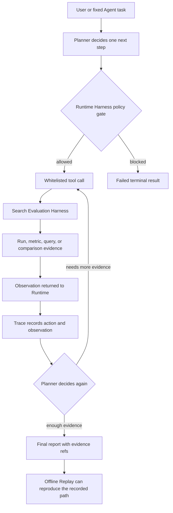
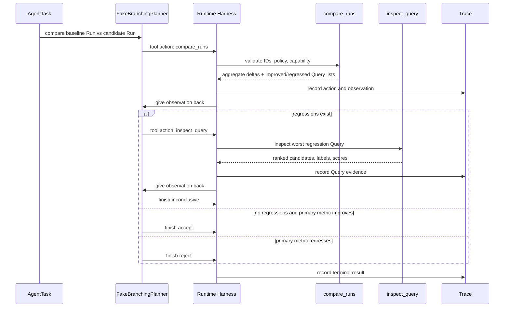

# Agent flow visual guide

> Purpose: make the current Agent path readable before the real model Planner is
> connected. This document explains what already exists, what is still scaffold,
> and how evidence moves through the system.

## One-sentence mental model

The Agent is not the search engine. The Agent is the controller that asks the
search evaluation tools what happened, observes the evidence, then decides
whether to inspect more, stop, accept, reject, or say the evidence is
inconclusive.

## Current vertical slice



The important loop is:

```text
plan -> act -> observe -> decide -> act again or finish
```

This loop is the minimum reason we can call it an Agent scaffold. A fixed script
would run the same steps regardless of the observation. The current Planner
branches based on the comparison result.

## What happens in the real smoke run



For the latest observed path, BM25 improved the average primary metric but still
had regressed queries. The Agent therefore did not blindly accept the candidate.
It inspected the largest regression and returned `inconclusive`.

## Two different systems that touch each other

```text
Search system path
Query -> tokenizer/index -> ranker -> ranked products

Search evaluation path
Ranked products + ESCI labels -> metrics -> Run artifact

Agent path
Task -> Planner -> Runtime -> tools -> observations -> Trace -> final report
```

These three paths should stay separate in your head:

| Path | Main question | Current example |
|---|---|---|
| Search system | What products should this query return? | full-catalog title BM25 search on the website |
| Search evaluation | Did one ranking strategy beat another? | random vs keyword overlap vs title BM25 on smoke |
| Agent | What should I inspect next, and what can I conclude from evidence? | compare runs, inspect worst regression, then finish |

## What is real now

| Area | Status | Meaning |
|---|---|---|
| Runtime state machine | Real | The loop has bounded states and stop conditions. |
| Tool allowlist | Real | The Agent can call only approved search-evaluation tools. |
| Tool schemas | Real | Inputs and outputs are strict structured contracts. |
| Run registry | Real | The Agent uses trusted smoke Run IDs, not arbitrary files. |
| Trace | Real | Actions, observations and terminal result are recorded. |
| Replay | Real | A historical Trace can be checked without rerunning tools. |
| Planner intelligence | Scaffold | It is deterministic, not an LLM yet. |
| Data scope | Smoke only | It cannot use 500-query dev or frozen test yet. |
| Optimization ability | Not yet | It diagnoses evidence; it does not tune ranking configs yet. |

## Code map

| Concept | File |
|---|---|
| Runtime loop and budgets | `src/search_quality/agent/runtime.py` |
| Current deterministic Planner | `src/search_quality/agent/planner.py` |
| Tool schemas and adapters | `src/search_quality/agent/tools.py` |
| Agent contracts | `src/search_quality/agent/contracts.py` |
| Evidence grounding | `src/search_quality/agent/grounding.py` |
| Trace storage | `src/search_quality/agent/trace.py` |
| Replay checker | `src/search_quality/agent/replay.py` |
| Human-readable final report | `src/search_quality/agent/reporting.py` |

## What Stage 5 will add

Stage 5 adds an Agent Evaluation Harness. That means we stop judging the Agent
by vibes and give it fixed tasks with expected evidence behavior.

Examples:

```text
Task: Find the worst BM25 regression in smoke and cite Query evidence.
Expected: compare_runs is called, inspect_query is called for the worst
regression, final report cites the comparison and Query evidence.
```

That is different from the Search Evaluation Harness. Search Evaluation Harness
scores rankers. Agent Evaluation Harness scores whether the Agent completed its
diagnosis task correctly.

## Interview-safe explanation

You can say:

> The current system has a smoke-only Agent Runtime scaffold. It already has
> tool schemas, permission gates, budget limits, evidence grounding, Trace and
> Replay. The Planner is intentionally deterministic for now, so it proves the
> control and evidence path, not final LLM reasoning. The next milestone is an
> Agent Evaluation Harness with fixed tasks to measure whether the Agent really
> completes diagnosis work.

