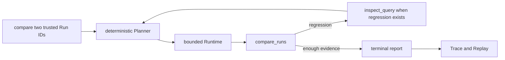
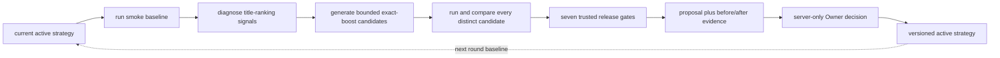
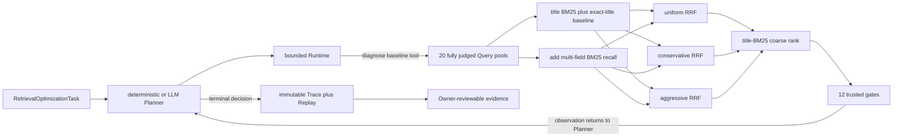
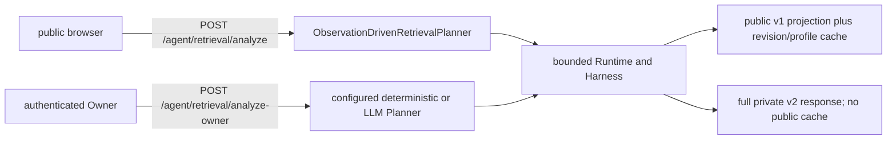

# Agent flow visual guide

> Purpose: show the capabilities that exist today without drawing future
> connections as if they were already implemented.

## One-sentence mental model

The search engine ranks products, the Search Evaluation Harness measures two
rankings, and the optimization Agent chooses which bounded experiment to try
next. The optional LLM Planner may choose an experiment or stop after each
Observation; it does not own metrics, tool arguments, approval or publication.

## What is implemented now

There are two smoke-only Runtime task families plus one older exact-boost
controller. They share evidence principles, but only the trusted-Run comparison
and stage-aware retrieval paths currently produce Runtime Trace/Replay evidence.

### A. Agent Runtime and trusted-Run comparison



This path has a state machine, strict tool schemas, an allowlist, budgets,
Trace and Replay. Its current task is passive: the caller supplies two trusted
Run IDs. It does not yet create optimization strategies.

### B. Deterministic optimizer v2



This path is implemented by `generate_strategy_proposal()` rather than the
Agent Runtime. It scans the fixed smoke Queries, diagnoses numeric-token,
coverage, exact-phrase and missing-title signals, searches an allowlisted
exact-boost parameter set, calls the deterministic Harness, and produces one
reviewable proposal. If the implemented strategy family cannot address the
evidence, it returns `requires_engineering` instead of pretending the service
failed.

The first round starts from title BM25. After an approved config exists, the
next round uses that exact config as its baseline and skips duplicate
candidates.

### C. Stage-aware retrieval Agent task



This slice distinguishes relevant products lost at recall, fusion and coarse
rank. The deterministic control observes the baseline, tests uniform,
conservative and one bounded aggressive probe, then selects the best passing
candidate. The optional LLM Planner instead chooses one server-generated option
ID per Observation and may change candidate order or stop once a passing
candidate exists. Grounding validates every choice against the current finite
option set, while Replay recomputes that set without invoking the Planner or
tools. “Eligible” is not “approved” or “active”: this path writes Runs,
diagnoses, comparisons and a Trace only.

### Two HTTP entry points, one safety boundary



The anonymous route is permanently wired to
`ObservationDrivenRetrievalPlanner`. It never reads `SEARCH_AGENT_PLANNER`, a
provider/model setting or a provider Key, even when the service's Owner mode is
configured for LLM use. It returns only the strict public v1 projection and
caches it by `(profile, SEARCH_CODE_REVISION)`.

The Owner-only route is the sole HTTP analysis route that resolves
`SEARCH_AGENT_PLANNER`, provider, model and server-side Key configuration. It
returns the full v2 Runtime summary and is deliberately excluded from the
public cache, so each authenticated request is an auditable new run. The two
routes share the same non-blocking single-flight lock, preventing concurrent
public and Owner analyses from competing for the bounded Runtime. The readiness
route, `GET /agent/retrieval/status`, is also Owner-only because it exposes the
configured provider/model identity, although it never returns a Key or Prompt.

## What the website can and cannot do

| Capability | Current status |
|---|---|
| Start smoke analysis | Implemented through `POST /agent/strategy/propose` |
| Show diagnosis, candidate experiments, three core metrics, gates and ten Query comparisons | Implemented |
| Start public stage-aware retrieval analysis | Implemented through `POST /agent/retrieval/analyze`; always deterministic, strict public v1 and cached |
| Start configured Owner analysis | Implemented through Owner-only `POST /agent/retrieval/analyze-owner`; full v2, deterministic or LLM, never public-cached |
| Read configured LLM/deterministic readiness and budgets | Implemented through Owner-only `GET /agent/retrieval/status`; no Key or Prompt is returned |
| Show recall/fusion/coarse metrics, all RRF candidates, gates and product Top 10 evidence | Implemented locally; not yet claimed deployed |
| Show the ordered Runtime actions, reasons, gate outcomes, evidence IDs and Trace ID | Implemented locally as a read-only timeline; validated against the backend response |
| Approve or reject from the public browser | Intentionally disabled |
| Approve from the server's loopback Owner channel | Implemented with evidence revalidation, trusted gates, active revision check and file lock |
| Make `/catalog/search` use the approved strategy | Not implemented |
| Run larger-set validation and automatic rollback | Not implemented |

The website therefore visualizes a real deterministic backend analysis, but it
does not have production publication authority or access to paid model quota.
The full configured Planner and decision surfaces remain Owner-only; opening a
decision route to the public would additionally require authenticated identity,
CSRF protection and an auditable authorization design.

## Three systems to keep separate

```text
Search system
Query -> tokenizer/index -> ranker -> ranked products

Search Evaluation Harness
ranked products + ESCI labels -> metrics -> Run + Comparison

Optimization Agent Runtime
task -> Planner -> allowlisted tools -> observations -> Harness -> Trace -> Owner gate
```

| System | Main question | Current example |
|---|---|---|
| Search | What products should this Query return? | full-catalog SQLite FTS title baseline |
| Search evaluation | Did one Ranker beat another? | smoke nDCG/MRR/Success and per-Query Diff |
| Optimization | Which safe experiment should run next? | stage-aware observation branch plus 12 gates |

## Code map

| Capability | File |
|---|---|
| Runtime loop and budgets | `src/search_quality/agent/runtime.py` |
| Runtime Planner | `src/search_quality/agent/planner.py` |
| Tool contracts and adapters | `src/search_quality/agent/tools.py` |
| Trace and Replay | `src/search_quality/agent/trace.py`, `replay.py` |
| Optimizer orchestration | `src/search_quality/agent/optimization.py` |
| Diagnosis, candidate search, selection score and gates | `src/search_quality/agent/strategy_search.py` |
| Stage-aware Runtime entry | `src/search_quality/agent/retrieval_runtime.py` |
| Stage-aware Planner and semantic validator | `src/search_quality/agent/retrieval_planner.py` |
| LLM Planner, aggregate projection and config | `src/search_quality/agent/llm_retrieval_planner.py` |
| Killable official-provider boundary | `src/search_quality/agent/llm_provider.py`, `llm_worker.py` |
| Stage-aware allowlisted tools and response builder | `src/search_quality/agent/retrieval_tools.py` |
| Recall channels, RRF and coarse pipeline | `src/search_quality/retrieval/` |
| Retrieval evidence revalidation and gates | `src/search_quality/evaluation/retrieval_validation.py`, `retrieval_comparison.py` |
| Search Evaluation Harness | `src/search_quality/evaluation/` |

## Next integration

The stage-aware path is now one Runtime execution, and its optional model adapter
replaces only the untrusted option-selection portion under the same schema,
budget and permission boundary. A first real-provider smoke is recorded, but
repeated deterministic-versus-LLM evaluation is still required for task
success, variance, Tokens and latency. Production remains deterministic until
the Owner separately reviews model, spend and activation. The separate
exact-boost controller can later be migrated behind the same task, tool and
Trace contracts.

The remaining product path is:

```text
fixed Agent evaluation tasks
-> source-bounded Query constructor
-> larger labeled validation
-> authenticated Owner approval
-> active full-catalog strategy
-> health check and rollback
```

## Interview-safe explanation

> I currently have a bounded smoke-only Agent Runtime with two task families.
> For stage-aware retrieval I keep a deterministic control and an optional LLM
> Planner. The LLM sees only aggregate gates and selects one allowed option ID;
> Runtime constructs and executes the action, Harness judges it, and Replay
> validates the recorded path. The model has no strategy-write or deployment
> authority. The implementation is smoke-only; real-provider quality, larger
> validation and production activation remain separate gates.
