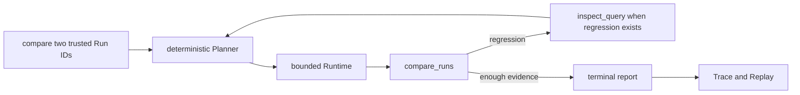
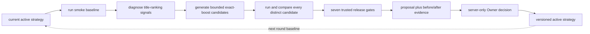

# Agent flow visual guide

> Purpose: show the capabilities that exist today without drawing future
> connections as if they were already implemented.

## One-sentence mental model

The search engine ranks products, the Search Evaluation Harness measures two
rankings, and the optimization Agent chooses which bounded experiment to try
next. The model, when added, may propose hypotheses; it will not own metrics or
publication.

## What is implemented now

There are two real smoke-only slices. They share evidence contracts, but they
are not yet one Runtime execution.

### A. Agent Runtime scaffold



This path has a state machine, strict tool schemas, an allowlist, budgets,
Trace and Replay. Its current task is passive: the caller supplies two trusted
Run IDs. It does not yet create optimization strategies.

### B. Deterministic optimizer v2



This path is implemented by `generate_strategy_proposal()` rather than the
Agent Runtime. It scans the fixed smoke Queries, diagnoses numeric-token,
coverage, exact-phrase and missing-title signals, searches an allowlisted
exact-boost parameter set, calls the deterministic Harness, and produces one
reviewable proposal. If the implemented strategy family cannot address the
evidence, it returns `requires_engineering` instead of pretending the service
failed.

The first round starts from title BM25. After an approved config exists, the
next round uses that exact config as its baseline and skips duplicate
candidates.

## What the website can and cannot do

| Capability | Current status |
|---|---|
| Start smoke analysis | Implemented through `POST /agent/strategy/propose` |
| Show diagnosis, candidate experiments, three core metrics, gates and ten Query comparisons | Implemented |
| Approve or reject from the public browser | Intentionally disabled |
| Approve from the server's loopback Owner channel | Implemented with evidence revalidation, trusted gates, active revision check and file lock |
| Make `/catalog/search` use the approved strategy | Not implemented |
| Run larger-set validation and automatic rollback | Not implemented |

The website therefore visualizes a real backend analysis, but it does not have
production publication authority. Opening the decision route to the public
requires Owner authentication, CSRF protection and audit identity.

## Three systems to keep separate

```text
Search system
Query -> tokenizer/index -> ranker -> ranked products

Search Evaluation Harness
ranked products + ESCI labels -> metrics -> Run + Comparison

Optimization controller
evidence -> diagnosis -> bounded candidates -> Harness -> proposal -> Owner gate
```

| System | Main question | Current example |
|---|---|---|
| Search | What products should this Query return? | full-catalog SQLite FTS title baseline |
| Search evaluation | Did one Ranker beat another? | smoke nDCG/MRR/Success and per-Query Diff |
| Optimization | Which safe experiment should run next? | exact-boost grid with regression gates |

## Code map

| Capability | File |
|---|---|
| Runtime loop and budgets | `src/search_quality/agent/runtime.py` |
| Runtime Planner | `src/search_quality/agent/planner.py` |
| Tool contracts and adapters | `src/search_quality/agent/tools.py` |
| Trace and Replay | `src/search_quality/agent/trace.py`, `replay.py` |
| Optimizer orchestration | `src/search_quality/agent/optimization.py` |
| Diagnosis, candidate search, selection score and gates | `src/search_quality/agent/strategy_search.py` |
| Search Evaluation Harness | `src/search_quality/evaluation/` |

## Next integration

The project becomes one fuller Agent when the optimizer actions are expressed
as Runtime tools and decisions, so a Trace can prove why it diagnosed a cause,
selected a candidate, changed course after a failed gate, or stopped with
`requires_engineering`. A future model adapter can then replace only the
hypothesis-selection portion under the same schema, budget and permission
boundary.

The remaining product path is:

```text
optimizer tools inside Runtime
-> Agent evaluation tasks
-> larger labeled validation
-> authenticated Owner approval
-> active full-catalog strategy
-> health check and rollback
```

## Interview-safe explanation

> I currently have two complementary smoke-only slices: a bounded Agent Runtime
> that can compare trusted Runs with Trace/Replay, and a deterministic optimizer
> that diagnoses bad cases, runs multiple allowlisted strategies through the
> Search Harness, applies trusted regression gates and creates an Owner-reviewed
> proposal. They are not yet one Runtime trace, and an approved config does not
> yet change the full-catalog website search. That integration is the next
> milestone.
