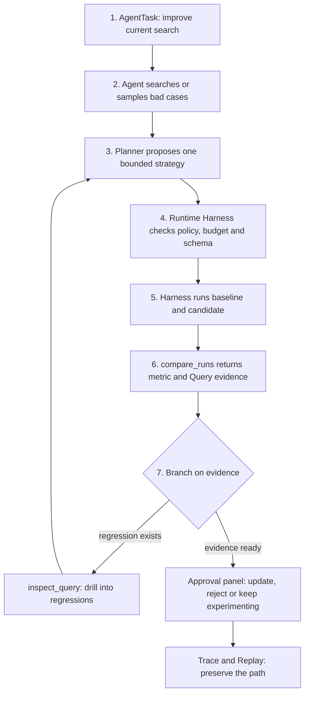

# Agent flow visual guide

> Purpose: make the current Agent path readable before the real model Planner is
> connected. This document explains what already exists, what is still scaffold,
> and how evidence moves through the system.

## One-sentence mental model

The Agent is not the search engine. The Agent is the controller that finds bad
cases, proposes bounded search-strategy changes, asks the evaluation tools what
happened, observes the evidence, then prepares an approval decision for a human.

## Current vertical slice



The important loop is:

```text
plan -> act -> observe -> decide -> act again or finish
```

This loop is the minimum reason we can call it an Agent scaffold. A fixed script
would run the same steps regardless of the observation. The current Planner
branches based on the comparison result.

## What happens in the real smoke run

```text
1. Task asks the Agent to improve the current search baseline.
2. Agent samples current results or reads evaluation Runs to find bad cases.
3. Planner proposes one bounded strategy, such as a field-weight change.
4. Runtime validates the proposal and allowed tool calls.
5. Harness runs baseline and candidate under the same data boundary.
6. compare_runs returns aggregate metrics and worst regressions.
7. Agent summarizes the proposal, sample before/after results, metric deltas,
   local risks and evidence in an approval panel.
8. Human clicks update or reject. Only after approval does the system write a
   versioned strategy config and trigger validation.
9. Trace records the path, and Replay can check it later.
```

For the latest observed path, BM25 improved the average primary metric but still
had regressed queries. The Agent therefore should not blindly accept the
candidate. The target product behavior is to inspect the regression, propose a
bounded follow-up strategy, run the Harness again, then ask the human to approve
or reject the update.

## Two different systems that touch each other

```text
Search system path
Query -> tokenizer/index -> ranker -> ranked products

Search evaluation path
Ranked products + ESCI labels -> metrics -> Run artifact

Agent path
Task -> bad-case discovery -> strategy proposal -> Runtime -> tools ->
observations -> approval panel -> Trace
```

These three paths should stay separate in your head:

| Path | Main question | Current example |
|---|---|---|
| Search system | What products should this query return? | full-catalog title BM25 search on the website |
| Search evaluation | Did one ranking strategy beat another? | random vs keyword overlap vs title BM25 on smoke |
| Agent | What should I inspect, what strategy should I try, and should a human approve it? | find bad cases, propose a strategy, compare Runs, show an approval panel |

## What is real now

| Area | Status | Meaning |
|---|---|---|
| Runtime state machine | Real | The loop has bounded states and stop conditions. |
| Tool allowlist | Real | The Agent can call only approved search-evaluation tools. |
| Tool schemas | Real | Inputs and outputs are strict structured contracts. |
| Run registry | Real | The Agent uses trusted smoke Run IDs, not arbitrary files. |
| Trace | Real | Actions, observations and terminal result are recorded. |
| Replay | Real | A historical Trace can be checked without rerunning tools. |
| Planner intelligence | Scaffold | It is deterministic, not an LLM yet. |
| Data scope | Smoke only | It cannot use 500-query dev or frozen test yet. |
| Optimization ability | First smoke slice | It can propose one bounded exact-boost strategy, run Harness evidence, and apply only after approval. |
| Web approval panel | First API-backed slice | The portfolio page can request a proposal and record approve/reject through the backend. |

## Code map

| Concept | File |
|---|---|
| Runtime loop and budgets | `src/search_quality/agent/runtime.py` |
| Current deterministic Planner | `src/search_quality/agent/planner.py` |
| Tool schemas and adapters | `src/search_quality/agent/tools.py` |
| Agent contracts | `src/search_quality/agent/contracts.py` |
| Strategy proposal loop | `src/search_quality/agent/optimization.py` |
| Evidence grounding | `src/search_quality/agent/grounding.py` |
| Trace storage | `src/search_quality/agent/trace.py` |
| Replay checker | `src/search_quality/agent/replay.py` |
| Human-readable final report | `src/search_quality/agent/reporting.py` |

## What Stage 5 will add

Stage 5 adds an Agent Evaluation Harness. That means we stop judging the Agent
by vibes and give it fixed tasks with expected evidence behavior.

Examples:

```text
Task: Find the worst BM25 regression in smoke and cite Query evidence.
Expected: compare_runs is called, inspect_query is called for the worst
regression, final report cites the comparison and Query evidence.
```

That is different from the Search Evaluation Harness. Search Evaluation Harness
scores rankers. Agent Evaluation Harness scores whether the Agent completed its
diagnosis task correctly.

## What Stage 7/8 will add

Stage 7 turns the Agent from passive comparison into proactive optimization:

```text
find bad case -> propose strategy -> run Harness -> compare -> approval panel
```

Stage 8 puts this into the website. The human should see the proposed strategy,
sample before/after rankings, metric changes, local regressions and evidence
IDs, then click `Update Strategy` or `Reject Strategy`.

## Interview-safe explanation

You can say:

> The product direction is an approval-gated search optimization Agent. It
> should find bad cases, propose bounded strategy changes, run the Harness,
> compare before/after evidence, and show a panel where humans approve or reject
> the update. The current code has the smoke-only Runtime and evidence scaffold;
> proactive strategy proposal and the approval panel are the next capabilities.
